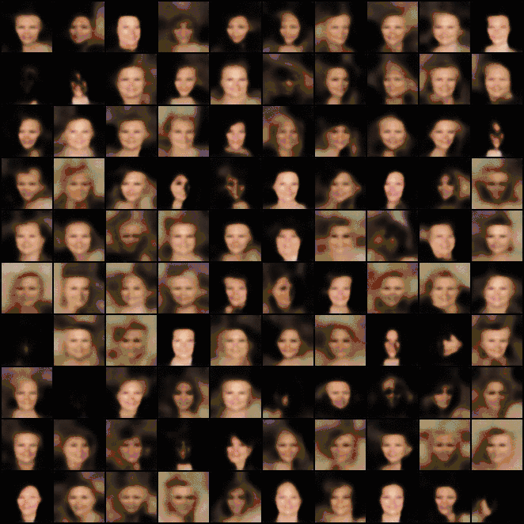
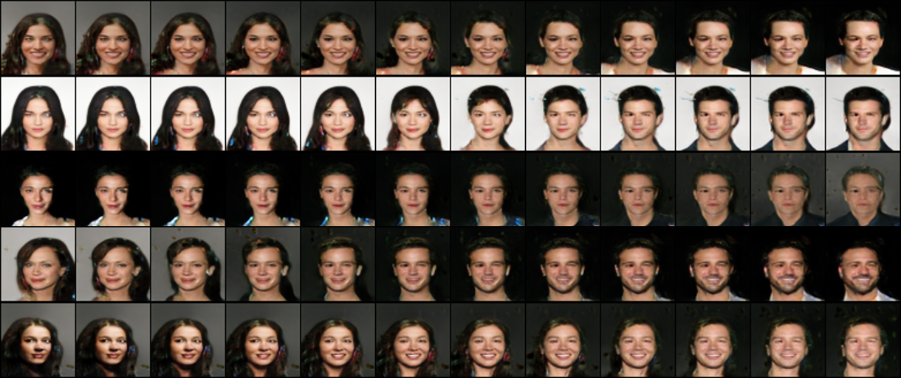

# BEGAN : Boundary Equilibrium Generative Adversarial Networks
<br>

### Overview
Pytorch implementation of BEGAN([arxiv:1703.10717])


## Objectives


## Architectures


## Measure of Convergence

<br>

### Dependencies
```
python 3.6.4
pytorch 0.3.1.post2
visdom
```
<br>

### Usage
initialize visdom.
```
python -m visdom.server
```
train using CIFAR10 dataset. checkpoint will automatically be saved in ```checkpoint/run1``` for every epoch.
```
python main.py --model_type skip_repeat --dataset cifar10 --env_name run1
```
you can load checkpoint and continue training. make sure ```--env_name``` matched to previous runs.
```
python main.py --model_type skip_repeat --dataset cifar10 --env_name run1 --load_ckpt True
```
you can check the training process.
```
localhost:8097
```
you can also train using your own dataset. make sure your dataset is appropriate for pytorch ImageFolder class. please check data directory tree below.
```
python main.py --model_type skip_repeat --dataset custom_dataset --env_name run1
```
<br>

### [data directory tree]
```
.
└── data
    └── CelebA
        └── img_align_celeba
            ├── 000001.jpg
            ├── 000002.jpg
            ├── ...
            └── 202599.jpg
    ├── custom_dataset
        └── folder1
            ├── image1.jpg
            ├── ...
    └── ...
```
<br>

### Results : CIFAR10(32x32)
```
python main.py --dataset cifar10 --image_size 32 --batch_size 16 --model_type skip_repeat --hidden_dim 64 --n_filter 32 --n_repeat 2
```
#### fixed generation


#### random generation


#### measure of convergence

<br>

### Results : CelebA(aligned, 64x64)
(you can download CelebA dataset [here])
```
python main.py --dataset celeba --image_size 64 --batch_size 16 --model_type skip_repeat --hidden_dim 64 --n_filter 64 --n_repeat 2
```
#### fixed generation

#### random generation

#### interpoloation



<br>

### References
1. BEGAN : Boundary Equilibrium Generative Adversarial Networks([arxiv:1703.10717])

[arxiv:1703.10717]: https://arxiv.org/abs/1703.10717
[here]: http://mmlab.ie.cuhk.edu.hk/projects/CelebA.html
[data directory tree]: http://pytorch.org/docs/master/torchvision/datasets.html?highlight=image%20folder#torchvision.datasets.ImageFolder
